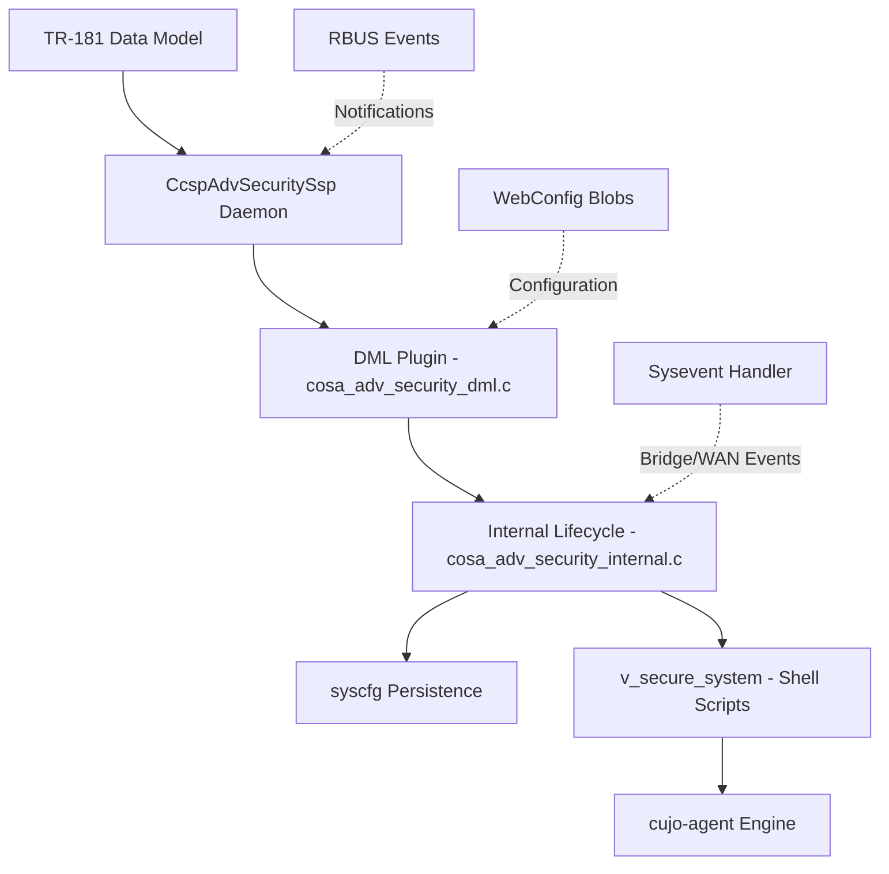

# CcspAdvSecurity — Advanced Security

[](../LICENSE)
[](https://en.wikipedia.org/wiki/C_(programming_language))
[](https://www.yoctoproject.org/)

An RDK-B security daemon providing device fingerprinting, safe browsing, softflowd, advanced parental controls, privacy protection, and 16+ RFC-controlled security features on embedded devices.

## Overview

CcspAdvSecurity (`CcspAdvSecuritySsp`) is a CCSP component that manages the cujo-agent security engine lifecycle on resource-constrained embedded Linux devices. It exposes TR-181 parameters for remote management and coordinates feature activation through shell scripts.

### Key Features

- **Device Fingerprinting**: Network device identification and classification via cujo-agent
- **Safe Browsing**: DNS-based threat protection with configurable lookup timeouts
- **Softflowd**: NetFlow/IPFIX flow export for network visibility
- **Advanced Parental Controls**: Content filtering and access control
- **Privacy Protection**: Tracker blocking and privacy enforcement
- **16+ RFC Toggles**: Remote feature control via TR-181 parameters
- **WebConfig Integration**: Blob-based configuration via `AdvancedSecurity_SetParamStringValue`

### Architecture

```
┌────────────────────────────────────────────────────┐
│              CcspAdvSecuritySsp                     │
│  ┌──────────┐  ┌───────────┐  ┌────────────────┐  │
│  │ DML      │  │ Internal  │  │ SSP Daemon     │  │
│  │ Handlers │──│ Lifecycle │──│ (CCSP/RBUS)    │  │
│  └──────────┘  └───────────┘  └────────────────┘  │
│       │              │                             │
│  ┌──────────┐  ┌───────────┐                       │
│  │ WebConfig│──│ Plugin    │                       │
│  └──────────┘  └───────────┘                       │
└────────────────────────────────────────────────────┘
         │                    │
    cujo-agent           syscfg/sysevent
```

## Quick Start

### Build

```bash
./autogen.sh
./configure
make
```

### Run

```bash
systemctl start CcspAdvSecuritySsp
```

### Unit Tests

```bash
./configure --enable-unitTestDockerSupport
make -C source/test
source/test/run_ut.sh
```

## Documentation

See [docs/README.md](../docs/README.md) for the full documentation index:

| Document | Content |
|----------|---------|
| [Architecture](../docs/architecture.md) | System design, feature lifecycle, threading, dependencies |
| [Workflows](../docs/workflows.md) | Feature enable/disable, RFC toggle, webconfig flows |
| [Troubleshooting](../docs/troubleshooting.md) | Decision trees, log signatures, RCA workflow |
| [Developer Playbook](../docs/developer-playbook.md) | Shell commands for debugging and validation |
| [Getting Started](../docs/onboarding.md) | 30-minute onboarding for new engineers |
| [API Reference](../docs/reference/api-reference.md) | DML and internal function reference |
| [Feature Catalog](../docs/reference/feature-catalog.md) | Feature-by-feature specification |
| [TR-181 Matrix](../docs/reference/tr181-matrix.md) | Parameter-to-code ownership map |

## Project Structure

```
advanced-security/
├── source/
│   ├── AdvSecurityDml/     # DML plugin (handlers, internal logic, webconfig)
│   ├── AdvSecuritySsp/     # SSP daemon (main, message bus)
│   └── test/               # Unit tests (gtest/gmock)
├── scripts/                # cujo-agent lifecycle scripts
├── config/                 # TR-181 XML data model
├── docs/                   # Documentation
└── .github/                # AI tooling, instructions, skills
```

## Build Flags

| Flag | Effect |
|------|--------|
| `WIFI_DATA_COLLECTION` | Enable WiFi data collection via cujoagent_dcl_api |
| `DOWNLOADMODULE_ENABLE` | Use `/tmp/cujo_dnld` as temp download location |
| `WAN_FAILOVER_SUPPORTED` | Enable WAN failover handling |
| `_COSA_BCM_MIPS_` | Broadcom MIPS platform — uses dpoe_hal instead of cm_hal |
| `_COSA_INTEL_XB3_ARM_` | Intel XB3 ARM platform — restricts certain RFC features |
| `_COSA_DRG_TPG_` | Arris DRG/TPG platform variant |
| `CONFIG_CISCO` | Cisco platform variant |
| `PON_GATEWAY` | PON gateway platform |
| `_XER5_PRODUCT_REQ_` | XER5 product-specific requirements |
| `_SCER11BEL_PRODUCT_REQ_` | SCER11BEL product-specific requirements |

## Contributing

See [CONTRIBUTING.md](../CONTRIBUTING.md) for guidelines.

## License

Apache License 2.0 — see [LICENSE](../LICENSE).

### Architecture Highlights



## Build (Detailed)

### Prerequisites

- GCC 4.8+ or Clang 3.5+
- pthread library
- CCSP libraries (libccsp_common, cosa_plugin_api)
- syscfg/sysevent libraries
- cJSON library
- Autotools (autoconf, automake, libtool)

### Build

```bash
# Clone repository
git clone https://github.com/rdkcentral/CcspAdvSecurity.git
cd CcspAdvSecurity

# Configure
autoreconf -i
./configure

# Build
make

# Install
sudo make install
```

### Docker Development

Refer to the provided Docker container for a consistent development environment:

https://github.com/rdkcentral/docker-device-mgt-service-test

## Documentation

📚 **Agentic Development Framework**

### Key Documents

- **[Agentic Dev README](AGENTIC_DEV_README.md)** — Full guide to AI-assisted development, agents, skills, and workflows
- **[Documentation Guide](DOCUMENTATION_GUIDE.md)** — Writing standards for playbooks and triage artifacts
- **[Copilot Instructions](copilot-instructions.md)** — Always-on project constraints
- **[Runtime Docs Hub](../docs/README.md)** — Architecture, workflows, troubleshooting, and API references

### Agents

- **[Advanced Security Agent](agents/advanced-security.agent.md)** — Comprehensive AI agent for debugging, triage, RCA, and development

### Skills

- **[Code Review](skills/code-review/SKILL.md)** — PR analysis with regression risk scoring
- **[Incident Analysis](skills/incident-analysis/SKILL.md)** — Confidence-scored RCA with hypothesis/disproof workflow
- **[Quality Checker](skills/quality-checker/SKILL.md)** — Container-based quality gate
- **[Safety Analyzer](skills/safety-analyzer/SKILL.md)** — Memory, thread-safety, and platform portability analysis

### Knowledge Base

- **[Reference Data](knowledge/reference-data.md)** — Enums, syscfg keys, constants, build flags, log signatures, and failure patterns

### Instructions (File-Scoped)

- **[C Embedded](instructions/c-embedded.instructions.md)** — Applies to `**/*.c`, `**/*.h`
- **[C++ Testing](instructions/cpp-testing.instructions.md)** — Applies to `source/test/**/*.cpp`
- **[Shell Scripts](instructions/shell-scripts.instructions.md)** — Applies to `**/*.sh`
- **[Build System](instructions/build-system.instructions.md)** — Applies to `**/Makefile.am`, `**/configure.ac`
