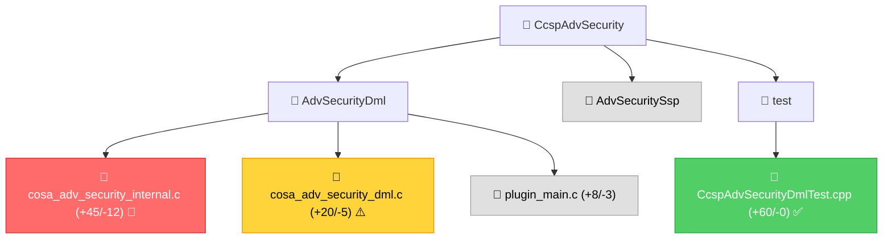

# Code Review for CcspAdvSecurity

## Purpose

Generate a comprehensive `REVIEW.md` report for GitHub pull requests that helps senior engineers quickly understand changes, assess impact, and identify potential functional regressions in the CcspAdvSecurity embedded codebase.

## Usage

Invoke this skill when:
- Reviewing a pull request before merge
- Analyzing code changes for regression risk in feature lifecycle paths
- Understanding the scope and impact of modifications
- Validating memory safety, thread safety, or API compatibility
- Preparing for code review meetings

**Invocation**: `@workspace /code-review <PR_URL_OR_NUMBER> [focus on <area>]`

---

## Output: REVIEW.md Structure

```markdown
# Code Review: [PR Title]

## Overview
- PR: #<number>
- Author: <username>
- Files Changed: X files, +Y/-Z lines
- Risk Level: [LOW | MEDIUM | HIGH | CRITICAL]

## Executive Summary
[2-3 sentence summary of changes and overall risk assessment]

## Coverity Static Analysis (if applicable)
[Table of Coverity defects found in PR comments]

## Changes by Module
[Visual tree showing impacted modules with change indicators]

## Detailed Analysis

### [Module 1]
#### Files Modified
#### Key Changes
#### Impact Assessment
- **Memory Safety**: [Analysis]
- **Thread Safety**: [Analysis]
- **API Compatibility**: [Analysis]
- **Error Handling**: [Analysis]
#### Regression Risks

## Cross-Cutting Concerns
## Recommendations
## Checklist
```

---

## Analysis Process

### Step 1: Fetch PR Metadata

```bash
gh pr view <PR_NUMBER> --json number,title,body,author,files,reviews,comments
```

Check for Coverity defects in comments from **rdkcmf-jenkins** or titles starting with **"Coverity Issue"**.

### Step 2: Get PR Diff

```bash
gh pr diff <PR_NUMBER>
```

Parse diff hunks to identify added, removed, and modified lines.

### Step 3: Categorize Changes by Module

Map changed files to CcspAdvSecurity architectural modules:

| Pattern | Module | Criticality |
|---------|--------|-------------|
| `source/AdvSecurityDml/cosa_adv_security_internal.*` | Internal Lifecycle | Critical |
| `source/AdvSecurityDml/cosa_adv_security_dml.*` | DML Handlers | Critical |
| `source/AdvSecurityDml/cosa_adv_security_webconfig.*` | WebConfig | High |
| `source/AdvSecurityDml/plugin_main.*` | Plugin Registration | High |
| `source/AdvSecurityDml/advsecurity_helpers.*` | Helpers | Medium |
| `source/AdvSecurityDml/advsecurity_param.*` | Parameters | Medium |
| `source/AdvSecurityDml/cujoagent_dcl_api.*` | WiFi DCL | Medium |
| `source/AdvSecuritySsp/*` | SSP Daemon | High |
| `scripts/*` | Agent Scripts | High |
| `source/test/*` | Unit Tests | Low |
| `*.am`, `*.ac` | Build System | Medium |
| `config/*` | Configuration | Medium |

### Step 4: Analyze Each Changed File

For each file, apply domain-specific analysis using [review checklist](./references/checklist.md):

#### C Source Files (*.c)
1. **Memory Safety** (reference: [safety-patterns.md](./references/safety-patterns.md))
   - New allocations → verify corresponding free
   - COSA struct chain → check all nested allocations
   - AnscAllocateMemory/AnscFreeMemory pairing

2. **Thread Safety** (reference: [safety-patterns.md](./references/safety-patterns.md))
   - `logMutex` usage → balanced lock/unlock
   - `g_pAdvSecAgent` access → NULL check
   - Logger/sysevent threads → shutdown safety

3. **Feature Lifecycle Safety**
   - Init/DeInit symmetry maintained
   - syscfg key consistency
   - Script flag correctness
   - Sentinel file management

4. **Security**
   - URL validation via `isValidUrl()`
   - No raw `system()` calls
   - Command injection prevention
   - No sensitive data logging

### Step 5: Assess Regression Risk

| Factor | Weight | Indicators |
|--------|--------|-----------|
| **Scope** | 30% | Files changed, modules impacted, LOC |
| **Criticality** | 25% | Internal lifecycle vs test, production path |
| **Complexity** | 20% | Control flow changes, new RFC toggles |
| **Safety** | 15% | Memory/thread safety issues identified |
| **Testing** | 10% | Test coverage, CI status |

**Risk Levels:**
- **LOW**: <10 files, single module, tests added, no safety concerns
- **MEDIUM**: 10-30 files, 2-3 modules, or minor safety concerns
- **HIGH**: >30 files, cross-module, or safety issues present
- **CRITICAL**: Internal lifecycle/DML logic, no tests, or confirmed safety issues

### Step 6: Generate Visual Diff Summary



### Step 7: Cross-Reference with Project Context

Load project-specific context:
1. [Review checklist](./references/checklist.md)
2. [Common pitfalls](./references/common-pitfalls.md)
3. [Safety patterns](./references/safety-patterns.md)

### Step 8: Generate Recommendations

1. **MUST FIX** (blocking): Memory leaks, race conditions, API breakage, missing URL validation, raw system() calls
2. **SHOULD FIX** (before merge): Test gaps, missing docs, non-optimal patterns
3. **CONSIDER** (future): Refactoring, optimization, code duplication

---

## Example Invocations

```
@workspace /code-review #42
@workspace /code-review #42 focus on thread safety
@workspace /code-review https://github.com/rdkcentral/CcspAdvSecurity/pull/42
```

---

## Output Location

- **Active PR**: `reviews/PR-<number>-REVIEW.md`
- **Quick review**: `REVIEW.md` (workspace root)

---

## Related Skills

- **quality-checker**: Run comprehensive quality checks
- **safety-analyzer**: Deep dive on memory, thread-safety, and other safety issues
- **incident-analysis**: Correlate observed failures and incidents with code changes
