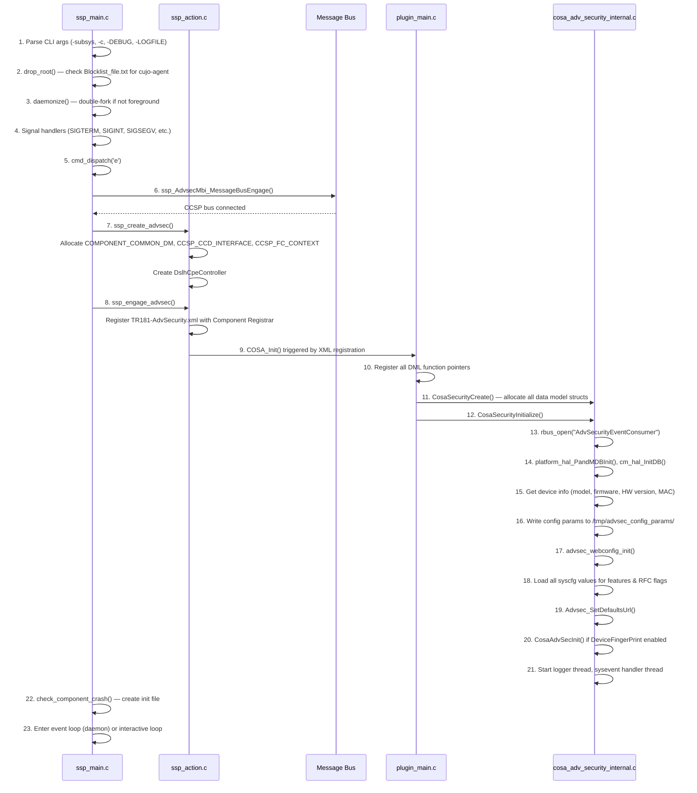

# Advanced Security Architecture

## 1. System Overview

Advanced Security (`CcspAdvSecuritySsp`) is an RDK-B CCSP component providing TR-181 parameter management for network security features. It operates as a middleware interface between remote management systems (TR-069/WebPA/TR-369) and the advanced security agent (`cujo-agent`) that performs actual threat detection and mitigation.

```
┌─────────────────────────────────────────────────────────────────┐
│                    RDK-B Management Layer                       │
│  ┌──────────┐  ┌───────────┐  ┌──────────┐  ┌───────────────┐  │
│  │ TR-069   │  │  WebPA /  │  │   PSM    │  │  Component    │  │
│  │   ACS    │  │  TR-369   │  │   DB     │  │  Registrar    │  │
│  └────┬─────┘  └─────┬─────┘  └────┬─────┘  └──────┬────────┘  │
└───────┼──────────────┼─────────────┼───────────────┼────────────┘
        │              │             │               │
┌───────┼──────────────┼─────────────┼───────────────┼────────────┐
│  ┌────▼──────────────▼─────────────▼───────────────▼────────┐   │
│  │              CcspAdvSecuritySsp Daemon                    │   │
│  │  ┌───────────┐ ┌───────────┐ ┌───────────┐ ┌──────────┐ │   │
│  │  │    SSP    │ │    DML    │ │ WebConfig │ │  WiFi    │ │   │
│  │  │ Bootstrap │ │  Plugin   │ │   Blob    │ │  DCL     │ │   │
│  │  │           │ │           │ │ Handler   │ │ Consumer │ │   │
│  │  └─────┬─────┘ └─────┬─────┘ └─────┬─────┘ └────┬─────┘ │   │
│  │        │              │             │             │       │   │
│  │        └──────┬───────┴─────────────┘             │       │   │
│  │               │                                   │       │   │
│  │        ┌──────▼───────┐                    ┌──────▼─────┐ │   │
│  │        │ Feature Ctrl │                    │ RBUS WiFi  │ │   │
│  │        │ Shell Scripts│                    │  Events    │ │   │
│  │        └──────┬───────┘                    └────────────┘ │   │
│  └───────────────┼──────────────────────────────────────────┘   │
└──────────────────┼──────────────────────────────────────────────┘
                   ▼
        ┌────────────────────┐        ┌──────────────────────┐
        │  cujo-agent        │        │  Kernel Modules      │
        │  (Security Agent)  │◄──────►│  nflua, luaconntrack │
        │  Device FP, SB,   │        │  netfilter/iptables  │
        │  Softflowd, APC   │        └──────────────────────┘
        └────────────────────┘
```

## 2. Components

| Component | Files | Purpose |
|-----------|-------|---------|
| **SSP Bootstrap** | `source/AdvSecuritySsp/ssp_main.c`, `ssp_action.c` | Daemonize, signal handling, privilege drop (`drop_root`), CCSP bus init, component registration |
| **Message Bus Interface** | `source/AdvSecuritySsp/ssp_messagebus_interface.c/h` | CCSP message bus engagement, callback registration |
| **DML Plugin** | `source/AdvSecurityDml/plugin_main.c/h` | COSA plugin entry (`COSA_Init`), registers all DML back-end API functions for TR-181 objects |
| **TR-181 DML Handlers** | `source/AdvSecurityDml/cosa_adv_security_dml.c/h` | Get/Set/Validate/Commit/Rollback handlers for all TR-181 parameters |
| **Internal Data Model** | `source/AdvSecurityDml/cosa_adv_security_internal.c/h` | Core lifecycle (`CosaSecurityCreate/Initialize/Remove`), feature init/deinit, syscfg persistence, sysevent handling, RBUS integration |
| **WebConfig Integration** | `source/AdvSecurityDml/cosa_adv_security_webconfig.c/h` | WebConfig subdoc handling: blob version mgmt, msgpack decode, apply/rollback |
| **Msgpack Helpers** | `source/AdvSecurityDml/advsecurity_param.c`, `advsecurity_helpers.c/h` | Msgpack buffer decoding for WebConfig blobs |
| **WiFi DCL Consumer** | `source/AdvSecurityDml/cujoagent_dcl_api.c/h` | WiFi Data Collection Layer: RBUS events, socket I/O, CSI data (conditional: `WIFI_DATA_COLLECTION`) |
| **Feature Control Scripts** | `scripts/advsec.sh`, `scripts/start_adv_security.sh` | Agent start/stop, feature enable/disable, kernel module loading, IPset management, firewall restart |
| **Recovery Script** | `scripts/advsec_cpu_mem_recovery.sh` | CPU and memory monitoring, agent process recovery |
| **Telemetry Script** | `scripts/advsec_log_fp_status.sh` | Feature status checking and telemetry logging |
| **Data Model XML** | `config/TR181-AdvSecurity.xml` | TR-181 object/parameter definitions, DML function bindings |

## 3. Initialization Sequence



## 4. Feature Modules

| Feature | TR-181 Object | RFC Toggle | Init Function | DeInit Function | syscfg Key |
|---------|--------------|------------|---------------|-----------------|------------|
| Device Fingerprinting | `X_RDKCENTRAL-COM_DeviceFingerPrint` | — (core feature) | `CosaAdvSecInit()` | `CosaAdvSecDeInit()` | `Advsecurity_DeviceFingerPrint` |
| Safe Browsing | `X_RDKCENTRAL-COM_AdvancedSecurity.SafeBrowsing` | `AdvSecSafeBrowsing_RFC` | `CosaAdvSecStartFeatures(ADVSEC_SAFEBROWSING)` | `CosaAdvSecStopFeatures(ADVSEC_SAFEBROWSING)` | `Advsecurity_SafeBrowsing` |
| Softflowd | `X_RDKCENTRAL-COM_AdvancedSecurity.Softflowd` | — | `CosaAdvSecStartFeatures(ADVSEC_SOFTFLOWD)` | `CosaAdvSecStopFeatures(ADVSEC_SOFTFLOWD)` | `Advsecurity_Softflowd` |
| Advanced Parental Control | `X_RDKCENTRAL-COM_AdvancedParentalControl` | `AdvancedParentalControl_RFC` | `CosaStartAdvParentalControl()` | `CosaStopAdvParentalControl()` | `Adv_PCActivate` |
| Privacy Protection | `X_RDKCENTRAL-COM_PrivacyProtection` | `PrivacyProtection_RFC` | `CosaStartPrivacyProtection()` | `CosaStopPrivacyProtection()` | `Adv_PPActivate` |
| Rabid Framework | `X_RDKCENTRAL-COM_RFC.Feature.RabidFramework` | — (config only) | — | — | `Advsecurity_RabidMemoryLimit/MacCacheSize/DNSCacheSize` |

## 5. RFC Feature Flags

| RFC Parameter (TR-181 Path) | DML Object | Init Function | DeInit Function | syscfg Key | Purpose |
|----------------------------|------------|---------------|-----------------|------------|---------|
| `Feature.AdvancedParentalControl.Enable` | `AdvancedParentalControl_RFC` | `CosaAdvPCInit()` | `CosaAdvPCDeInit()` | `Adv_PCRFCEnable` | Enable/disable parental controls |
| `Feature.PrivacyProtection.Enable` | `PrivacyProtection_RFC` | `CosaPrivacyProtectionInit()` | `CosaPrivacyProtectionDeInit()` | `Adv_PrivProtRFCEnable` | Enable/disable privacy protection |
| `Feature.DeviceFingerPrintICMPv6.Enable` | `DeviceFingerPrintICMPv6_RFC` | `CosaAdvDFIcmpv6Init()` | `CosaAdvDFIcmpv6DeInit()` | `Adv_DFICMPv6RFCEnable` | ICMPv6 fingerprinting |
| `Feature.WS-Discovery_Analysis.Enable` | `WS_Discovery_Analysis_RFC` | `CosaWSDisInit()` | `CosaWSDisDeInit()` | `Adv_WSDisAnaRFCEnable` | WS-Discovery protocol analysis |
| `Feature.AdvancedSecurityOTM.Enable` | `AdvancedSecurityOTM_RFC` | `CosaAdvSecOTMInit()` | `CosaAdvSecOTMDeInit()` | `Adv_AdvSecOTMRFCEnable` | OTM (Over-The-Top Monitoring) |
| `Feature.AdvanceSecurityUserSpace.Enable` | `AdvanceSecurityUserSpace_RFC` | `CosaAdvSecUserSpaceInit()` | — (DeInit commented out in source) | `Adv_AdvSecUserSpaceRFCEnable` | Userspace security processing (default: ON, cannot be disabled) |
| `Feature.AdvSecAgentRaptr.Enable` | `AdvSecAgentRaptr_RFC` | `CosaAdvSecAgentRaptrInit()` | `CosaAdvSecAgentRaptrDeInit()` | `Adv_RaptrRFCEnable` | Raptr framework (enable-only via TR-181) |
| `Feature.Levl.Enable` | `Levl_RFC` | `CosaLevlInit()` | `CosaLevlDeInit()` | `Adv_LevlRFCEnable` | WiFi LEVL integration |
| `Feature.AdvSecAgent.Enable` | `AdvSecAgent_RFC` | `CosaAdvSecAgentInit()` | `CosaAdvSecAgentDeInit()` | `Adv_AdvSecAgentRFCEnable` | Security agent control |
| `Feature.AdvSecSafeBrowsing.Enable` | `AdvSecSafeBrowsing_RFC` | `CosaAdvSecSafeBrowsingInit()` | `CosaAdvSecSafeBrowsingDeInit()` | `Adv_AdvSecSafeBrowsingRFCEnable` | SafeBrowsing RFC toggle |
| `Feature.AdvSecCujoTelemetryWiFiFP.Enable` | `AdvSecCujoTelemetryWiFiFP_RFC` | `CosaAdvSecCujoTelemetryWiFiFPInit()` | `CosaAdvSecCujoTelemetryWiFiFPDeInit()` | `Adv_AdvSecCujoTelemetryWiFiFPRFCEnable` | WiFi fingerprint telemetry |
| `Feature.AdvanceSecurityCujoTracer.Enable` | `AdvanceSecurityCujoTracer_RFC` | `CosaAdvSecCujoTracerInit()` | `CosaAdvSecCujoTracerDeInit()` | `Adv_AdvSecCujoTracerRFCEnable` | Cujo tracer |
| `Feature.AdvanceSecurityCujoTelemetry.Enable` | `AdvanceSecurityCujoTelemetry_RFC` | `CosaAdvSecCujoTelemetryInit()` | `CosaAdvSecCujoTelemetryDeInit()` | `Adv_AdvSecCujoTelemetryRFCEnable` | Cujo telemetry |
| `Feature.AdvSecSentryAtTheEdge.Enable` | `AdvSecSentryAtTheEdge_RFC` | `CosaAdvSecSATEInit()` | `CosaAdvSecSATEDeInit()` | `Adv_SATERFCEnable` | Sentry at the Edge |
| `Feature.AdvSecTCPTrackerFilterDevices.Enable` | `AdvSecTCPTrackerFilterDevices_RFC` | `CosaAdvSecTCPTrackerFilterDevicesInit()` | `CosaAdvSecTCPTrackerFilterDevicesDeInit()` | `Adv_TCPTrackerFilterDevicesRFCEnable` | TCP tracker device filtering |
| `Feature.WifiDataCollection.Enable` | `WifiDataCollection_RFC` | `CosaAdvWifiDataCollectionInit()` | `CosaAdvWifiDataCollectionDeInit()` | `Adv_WifiDataCollectionRFCEnable` | WiFi data collection (requires `WIFI_DATA_COLLECTION`) |

## 6. Threading Model

| Thread | Purpose | Source |
|--------|---------|--------|
| **Main thread** | Event loop (daemon mode) or interactive CLI | `ssp_main.c: main()` |
| **Logger thread** | Periodic telemetry logging with configurable period | `cosa_adv_security_internal.c: advsec_start_logger_thread()` |
| **Sysevent handler** | Monitors `bridge_mode`, `advsec_host_ip`, `mapt_config_flag`, `current_wan_ifname` | `cosa_adv_security_internal.c: advsec_handle_sysevent_async()` |
| **WiFi DCL thread** | Socket I/O for WiFi data collection (conditional) | `cujoagent_dcl_api.c` |

## 7. IPC and Dependencies

| Dependency | Interface | Purpose |
|-----------|-----------|---------|
| **CCSP Message Bus** | DBus/RBUS | Component registration, parameter access, inter-component communication |
| **Component Registrar (CR)** | CCSP | Data model registration via `TR181-AdvSecurity.xml` |
| **PSM (Persistent Storage Manager)** | CCSP | Parameter persistence |
| **syscfg** | Library | Feature enable/disable state persistence across reboots |
| **sysevent** | Library | Event-driven notifications (bridge mode, WAN interface changes) |
| **RBUS** | Library | Event subscription (`CurrentActiveInterface`, `Device.WiFi.Levl`), parameter get/set |
| **WebConfig Framework** | Library | Cloud-based configuration blob handling (msgpack) |
| **platform_hal** | HAL API | Device model, firmware, hardware version, MAC address |
| **cm_hal** | HAL API | Cable modem DHCP info for MAC retrieval |
| **cujo-agent** | IPC/Socket | Security enforcement engine (started/stopped via shell scripts) |
| **v_secure_system** | Library | Secure shell command execution for `advsec.sh` and `start_adv_security.sh` |
| **Kernel modules** | Netfilter | `nflua`, `luaconntrack` for packet inspection |

## 8. Build Flags

| Flag / Option | Effect |
|--------------|--------|
| `--enable-unitTestDockerSupport` | Includes `source/test/` in build for unit testing |
| `--with-ccsp-arch={arm,atom,pc,mips}` | Sets target CPU architecture conditionals |
| `--enable-downloadmodule` | Enables `DOWNLOADMODULE_ENABLE`: sets `TEMP_DOWNLOAD_LOCATION` to `/tmp/cujo_dnld` |
| `--enable-wifidcl` | Enables `WIFI_DATA_COLLECTION`: compiles WiFi DCL consumer, LEVL integration |
| `_COSA_BCM_MIPS_` | Platform: Broadcom MIPS — uses `dpoe_hal` for MAC, vendor = "ARRIS Group, Inc." |
| `_COSA_DRG_TPG_` | Platform: DRG/TPG — vendor = "ARRIS Group, Inc." |
| `CONFIG_CISCO` | Platform: Cisco — vendor = "Cisco" |
| `WAN_FAILOVER_SUPPORTED` | Enables RBUS subscription for `CurrentActiveInterface` WAN failover events |
| `INCLUDE_BREAKPAD` | Uses Breakpad exception handler instead of custom signal handlers |

## 9. Data Model Registration

The TR-181 data model is registered during `ssp_engage_advsec()`:

1. `ssp_engage_advsec()` calls `DslhCpeController` to load the data model XML
2. XML path: `TEMP_DOWNLOAD_LOCATION/usr/ccsp/advsec/TR181-AdvSecurity.xml`
3. The XML defines module `RDKCENTRAL_AdvSecurity` with library `libdmlasecurity`
4. Entry function: `COSA_Init` in `plugin_main.c`
5. `COSA_Init` registers all DML function pointers (Get/Set/Validate/Commit/Rollback) for each TR-181 object
6. Component registers with CR under the subsystem namespace (default `eRT.`)

## 10. Security Architecture

### Privilege Management

- `drop_root()` in `ssp_main.c` checks `/opt/secure/Blocklist_file.txt`
- If `cujo-agent` is in the blocklist → keeps root privileges, creates `/tmp/advsec_cujo_agent_root_priv`
- If not blocklisted → drops to non-root for the cujo-agent process
- The SSP process itself runs with standard CCSP daemon privileges

### Input Validation

- URL parameters validated via `isValidUrl()` — rejects non-HTTPS, blocks command injection characters (`;`, `&`, `|`, `'`)
- Rabid framework parameters bounded: `MIN_AGENT_MEMORY_HARD_LIMIT` = 45, `MAX_RABID_MACCACHE_SIZE` = 32768, `MAX_RABID_DNSCACHE_SIZE` = 32768
- SafeBrowsing `LookupTimeout` bounded: `ADVSEC_DEFAULT_LOOKUP_TIMEOUT` (350) to `ADVSEC_MAX_LOOKUP_TIMEOUT` (6000). Note: there is no separate `ADVSEC_MIN_LOOKUP_TIMEOUT` constant; the default value (350) is used as the lower bound
- Logging period bounded: `ADVSEC_MIN_LOG_TIMEOUT` (60) to `ADVSEC_MAX_LOG_TIMEOUT` (2880)
