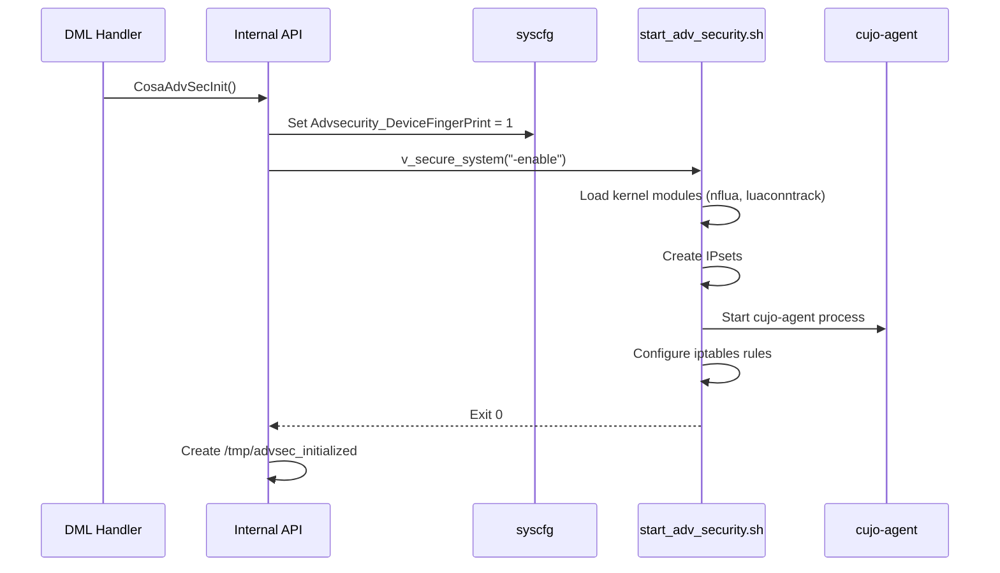
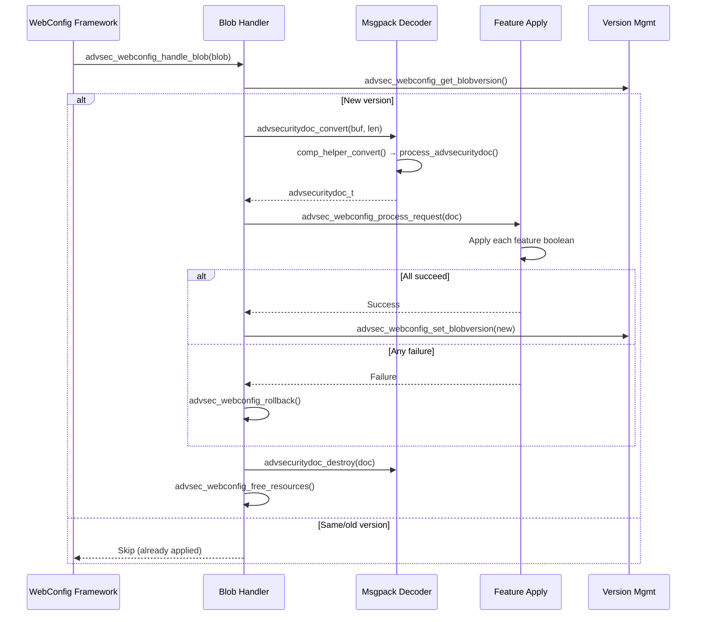

# Advanced Security Feature Catalog

This catalog documents all security feature modules, their RFC toggle dependencies, WebConfig integration, and interaction patterns.

## Why This Exists

- Feature interaction complexity: 16+ RFC toggles with dependency chains
- WebConfig blob can change multiple features atomically
- Most field issues stem from feature dependency or ordering problems
- This reference gives reviewers and incident responders a deterministic baseline

## Feature Families

1. **Core Features** — DeviceFingerPrint, SafeBrowsing, Softflowd
2. **Security Policies** — AdvancedParentalControl, PrivacyProtection
3. **Framework** — RabidFramework (configuration-only, no enable/disable)
4. **WiFi Data Collection** — DCL, LEVL (conditional build flag)
5. **RFC Feature Toggles** — 16 independent RFC toggles controlling sub-features

---

## 1. DeviceFingerPrint (Core Feature)

### Identity

- **TR-181**: `Device.DeviceInfo.X_RDKCENTRAL-COM_DeviceFingerPrint`
- **Parameters**: `Enable` (bool), `LoggingPeriod` (uint), `EndpointURL` (string), `LogLevel` (uint)
- **syscfg**: `Advsecurity_DeviceFingerPrint`
- **Init/DeInit**: `CosaAdvSecInit()` / `CosaAdvSecDeInit()`
- **Script**: `start_adv_security.sh -enable` / `-disable`

### Role

Master enable for the entire Advanced Security subsystem. All other features require DeviceFingerPrint to be enabled and initialized before they can activate at the agent level.

### Enable Flow

### Dependencies

- Requires device MAC, model, firmware info (populated during `CosaSecurityInitialize`)
- Requires CCSP bus and CR registration complete
- Creates prerequisite for all other features

### Failure Signatures

- `Device_Finger_Printing_enabled:false` — Feature disabled
- Missing `/tmp/advsec_initialized` — Init did not complete
- `cujo-agent` not in process list — Agent failed to start

---

## 2. SafeBrowsing

### Identity

- **TR-181**: `Device.DeviceInfo.X_RDKCENTRAL-COM_AdvancedSecurity.SafeBrowsing`
- **Parameters**: `Enable` (bool, writable), `LookupTimeout` (uint, writable), plus 11 read-only config params
- **syscfg**: `Advsecurity_SafeBrowsing`, `Advsecurity_LookupTimeout`
- **Init/DeInit**: `CosaAdvSecStartFeatures(ADVSEC_SAFEBROWSING)` / `CosaAdvSecStopFeatures(ADVSEC_SAFEBROWSING)`
- **Script**: `start_adv_security.sh -start sb null` / `-stop sb null`
- **RFC Toggle**: `AdvSecSafeBrowsing_RFC`

### DML Cycle

Although `SafeBrowsing_Validate()`, `SafeBrowsing_Commit()`, and `SafeBrowsing_Rollback()` are registered in the data model XML, they are **currently NO-OPs** in the source code. The actual enable/disable logic executes **directly in `SafeBrowsing_SetParamBoolValue()`**:
1. `SafeBrowsing_SetParamBoolValue("Enable", ...)` — checks DeviceFingerPrint enabled, calls `CosaAdvSecStartFeatures(ADVSEC_SAFEBROWSING)` or `CosaAdvSecStopFeatures(ADVSEC_SAFEBROWSING)` immediately
2. `SafeBrowsing_SetParamUlongValue("LookupTimeout", ...)` — validates range and calls `CosaAdvSecSetLookupTimeout()` immediately
3. `SafeBrowsing_Validate()` — always returns TRUE (NO-OP)
4. `SafeBrowsing_Commit()` — always returns 0 (NO-OP)
5. `SafeBrowsing_Rollback()` — always returns 0 (NO-OP)

### Read-Only Config

Retrieved via `CosaAdvSecFetchSbConfig()` from `/tmp/safebro.json`:
- `LookupTimeoutExceededCount` — from `/tmp/advsec_lkup_exceed_cnt`
- `Threshold`, `Timeout`, `Cachettl`, `Ttl`, `WhitelistMaxEntries` — numeric config
- `Endpoint`, `Blockpage`, `Warnpage`, `Cacheurl`, `OtmDedupFqdn` — string config

### Dependencies

- Requires DeviceFingerPrint enabled and initialized
- Agent must be running for config to take effect

---

## 3. Softflowd

### Identity

- **TR-181**: `Device.DeviceInfo.X_RDKCENTRAL-COM_AdvancedSecurity.Softflowd`
- **Parameters**: `Enable` (bool, writable)
- **syscfg**: `Advsecurity_Softflowd`
- **Init/DeInit**: `CosaAdvSecStartFeatures(ADVSEC_SOFTFLOWD)` / `CosaAdvSecStopFeatures(ADVSEC_SOFTFLOWD)`
- **Script**: `start_adv_security.sh -start null sf` / `-stop null sf`

### DML Cycle

Same as SafeBrowsing — `Softflowd_Validate()`, `Softflowd_Commit()`, and `Softflowd_Rollback()` are registered but are **NO-OPs**. Actual logic is in `Softflowd_SetParamBoolValue()`.

### Dependencies

- Requires DeviceFingerPrint enabled and initialized

---

## 4. AdvancedParentalControl

### Identity

- **TR-181**: `Device.DeviceInfo.X_RDKCENTRAL-COM_AdvancedParentalControl`
- **Parameters**: `Activate` (bool, writable)
- **syscfg**: `Adv_PCActivate`
- **Init/DeInit**: `CosaStartAdvParentalControl()` / `CosaStopAdvParentalControl()`
- **Script**: `start_adv_security.sh -startAdvPC` / `-stopAdvPC`
- **RFC Toggle**: `Feature.AdvancedParentalControl.Enable` → `Adv_PCRFCEnable`

### DML Cycle

Direct Set (no Validate/Commit/Rollback). `SetParamBoolValue` immediately calls Init/DeInit.

### Dependencies

- Requires DeviceFingerPrint enabled
- RFC toggle (`Adv_PCRFCEnable`) must be enabled for feature to be active

---

## 5. PrivacyProtection

### Identity

- **TR-181**: `Device.DeviceInfo.X_RDKCENTRAL-COM_PrivacyProtection`
- **Parameters**: `Activate` (bool, writable)
- **syscfg**: `Adv_PPActivate`
- **Init/DeInit**: `CosaStartPrivacyProtection()` / `CosaStopPrivacyProtection()`
- **Script**: `start_adv_security.sh -startPrivProt` / `-stopPrivProt`
- **RFC Toggle**: `Feature.PrivacyProtection.Enable` → `Adv_PrivProtRFCEnable`

### DML Cycle

Direct Set (same pattern as ParentalControl).

### Dependencies

- Requires DeviceFingerPrint enabled
- RFC toggle must be enabled

---

## 6. RabidFramework

### Identity

- **TR-181**: `Device.DeviceInfo.X_RDKCENTRAL-COM_RFC.Feature.RabidFramework`
- **Parameters**: `MemoryLimit` (uint), `MacCacheSize` (uint), `DNSCacheSize` (uint)
- **syscfg**: `Advsecurity_RabidMemoryLimit`, `Advsecurity_RabidMacCacheSize`, `Advsecurity_RabidDNSCacheSize`

### Behavior

Configuration-only — no enable/disable toggle, no Init/DeInit. Values are set via `CosaRabidSetMemoryLimit()`, `CosaRabidSetMacCacheSize()`, `CosaRabidSetDNSCacheSize()`.

### Bounds

| Parameter | Min | Max |
|-----------|-----|-----|
| MemoryLimit | 45 MB | — |
| MacCacheSize | — | 32768 |
| DNSCacheSize | — | 32768 |

---

## 7. RFC Toggle Master Table

| # | RFC Feature | TR-181 Path | Init Function | DeInit Function | syscfg Key | Controlled Behavior |
|---|------------|-------------|---------------|-----------------|------------|-------------------|
| 1 | AdvancedParentalControl | `Feature.AdvancedParentalControl.Enable` | `CosaAdvPCInit()` | `CosaAdvPCDeInit()` | `Adv_PCRFCEnable` | Parental controls |
| 2 | PrivacyProtection | `Feature.PrivacyProtection.Enable` | `CosaPrivacyProtectionInit()` | `CosaPrivacyProtectionDeInit()` | `Adv_PrivProtRFCEnable` | Privacy protection |
| 3 | DeviceFingerPrintICMPv6 | `Feature.DeviceFingerPrintICMPv6.Enable` | `CosaAdvDFIcmpv6Init()` | `CosaAdvDFIcmpv6DeInit()` | `Adv_DFICMPv6RFCEnable` | ICMPv6 device FP |
| 4 | WS-Discovery Analysis | `Feature.WS-Discovery_Analysis.Enable` | `CosaWSDisInit()` | `CosaWSDisDeInit()` | `Adv_WSDisAnaRFCEnable` | WS-Discovery |
| 5 | AdvancedSecurityOTM | `Feature.AdvancedSecurityOTM.Enable` | `CosaAdvSecOTMInit()` | `CosaAdvSecOTMDeInit()` | `Adv_AdvSecOTMRFCEnable` | Over-the-top monitoring |
| 6 | UserSpace | `Feature.AdvanceSecurityUserSpace.Enable` | `CosaAdvSecUserSpaceInit()` | — (DeInit commented out) | `Adv_AdvSecUserSpaceRFCEnable` | Userspace processing (default: ON, cannot be disabled via TR-181) |
| 7 | Raptr | `Feature.AdvSecAgentRaptr.Enable` | `CosaAdvSecAgentRaptrInit()` | `CosaAdvSecAgentRaptrDeInit()` | `Adv_RaptrRFCEnable` | Raptr framework (enable-only via TR-181) |
| 8 | CujoTracer | `Feature.AdvanceSecurityCujoTracer.Enable` | `CosaAdvSecCujoTracerInit()` | `CosaAdvSecCujoTracerDeInit()` | `Adv_AdvSecCujoTracerRFCEnable` | Cujo tracer |
| 9 | CujoTelemetry | `Feature.AdvanceSecurityCujoTelemetry.Enable` | `CosaAdvSecCujoTelemetryInit()` | `CosaAdvSecCujoTelemetryDeInit()` | `Adv_AdvSecCujoTelemetryRFCEnable` | Cujo telemetry |
| 10 | SATE | `Feature.AdvSecSentryAtTheEdge.Enable` | `CosaAdvSecSATEInit()` | `CosaAdvSecSATEDeInit()` | `Adv_SATERFCEnable` | Sentry at the Edge |
| 11 | TCPTrackerFilterDevices | `Feature.AdvSecTCPTrackerFilterDevices.Enable` | `CosaAdvSecTCPTrackerFilterDevicesInit()` | `CosaAdvSecTCPTrackerFilterDevicesDeInit()` | `Adv_TCPTrackerFilterDevicesRFCEnable` | TCP tracker filtering |
| 12 | WifiDataCollection | `Feature.WifiDataCollection.Enable` | `CosaAdvWifiDataCollectionInit()` | `CosaAdvWifiDataCollectionDeInit()` | `Adv_WifiDataCollectionRFCEnable` | WiFi DCL (requires build flag) |
| 13 | Levl | `Feature.Levl.Enable` | `CosaLevlInit()` | `CosaLevlDeInit()` | `Adv_LevlRFCEnable` | LEVL WiFi (requires build flag) |
| 14 | AdvSecAgent | `Feature.AdvSecAgent.Enable` | `CosaAdvSecAgentInit()` | `CosaAdvSecAgentDeInit()` | `Adv_AdvSecAgentRFCEnable` | Agent control |
| 15 | AdvSecSafeBrowsing | `Feature.AdvSecSafeBrowsing.Enable` | `CosaAdvSecSafeBrowsingInit()` | `CosaAdvSecSafeBrowsingDeInit()` | `Adv_AdvSecSafeBrowsingRFCEnable` | SafeBrowsing RFC |
| 16 | CujoTelemetryWiFiFP | `Feature.AdvSecCujoTelemetryWiFiFP.Enable` | `CosaAdvSecCujoTelemetryWiFiFPInit()` | `CosaAdvSecCujoTelemetryWiFiFPDeInit()` | `Adv_AdvSecCujoTelemetryWiFiFPRFCEnable` | WiFi FP telemetry |

### Special Behaviors

- **UserSpace RFC** (row 6): Defaults to enabled — if syscfg value is 0, init forces it to 1. **Cannot be disabled via TR-181** — `SetParamBoolValue(false)` returns `FALSE` immediately without persisting
- **Raptr RFC** (row 7): **Can only be enabled, never disabled via TR-181** — `SetParamBoolValue(false)` returns `FALSE` with log: "AdvSecAgentRaptr_RFC can't be disabled from agent"
- **AdvSecSafeBrowsing RFC** (row 15): Requires `UserSpace_RFC` enabled — returns FAILURE if `UserSpace_RFC` is disabled
- **AdvSecCujoTelemetryWiFiFP RFC** (row 16): Same `UserSpace_RFC` dependency as AdvSecSafeBrowsing
- **WifiDataCollection** (row 12): Requires `WIFI_DATA_COLLECTION` build flag + `Levl_RFC` enabled + `Device.WiFi.Levl` true + `UserSpace_RFC` enabled
- **Levl** (row 13): On enable, automatically enables `Device.WiFi.Levl` via RBUS if disabled

---

## 8. WebConfig Integration

### Registration

- Subdoc name: `advsecurity` (constant: `ADVSEC_WEBCONFIG_SUBDOC_NAME`)
- Registered during `CosaSecurityInitialize()` via `advsec_webconfig_init()`

### Blob Fields

| Msgpack Key | Type | Maps To |
|------------|------|---------|
| `FingerPrintEnable` | boolean | DeviceFingerPrint.Enable |
| `SoftflowdEnable` | boolean | Softflowd.Enable |
| `SafeBrowsingEnable` | boolean | SafeBrowsing.Enable |
| `ParentalControlActivate` | boolean | AdvancedParentalControl.Activate |
| `PrivacyProtectionActivate` | boolean | PrivacyProtection.Activate |

### Processing Lifecycle

### Error Codes

| Code | Constant | Meaning |
|------|----------|---------|
| 0 | `HELPERS_OK` | Success |
| 1 | `HELPERS_OUT_OF_MEMORY` | Allocation failure |
| 2 | `HELPERS_INVALID_FIRST_ELEMENT` | Wrong msgpack structure |
| 3 | `HELPERS_MISSING_WRAPPER` | Missing wrapper map |

---

## 9. Feature Dependency Matrix

| Feature | Requires DeviceFingerPrint | Requires RFC Toggle | Requires Build Flag | Requires Agent Running |
|---------|--------------------------|--------------------|--------------------|----------------------|
| DeviceFingerPrint | — (is the core) | — | — | Creates agent |
| SafeBrowsing | Yes | `AdvSecSafeBrowsing_RFC` | — | Yes |
| Softflowd | Yes | — | — | Yes |
| AdvancedParentalControl | Yes | `AdvancedParentalControl_RFC` | — | Yes |
| PrivacyProtection | Yes | `PrivacyProtection_RFC` | — | Yes |
| RabidFramework | — (config only) | — | — | Yes (for effect) |
| WiFi Data Collection | Yes | `WifiDataCollection_RFC` + `Levl_RFC` | `WIFI_DATA_COLLECTION` | Yes |
| All other RFC features | Yes | Themselves | — | Yes |

---

## 10. Edge Cases

### Feature enabled via TR-181 but RFC disabled

- The feature `Activate`/`Enable` value persists to syscfg
- But the shell script invocation checks both the feature flag AND the RFC flag
- Result: feature appears "enabled" in TR-181 but is not active at the agent level
- Triage: compare `syscfg get <feature_key>` with `syscfg get <rfc_key>`

### WebConfig overriding manual TR-181 settings

- WebConfig blob applies atomically — it may re-enable features a user manually disabled
- Blob version prevents re-application of the same config
- But a new blob version will override manual settings

### UserSpace RFC auto-enable

- If `Adv_AdvSecUserSpaceRFCEnable` is 0 in syscfg, init forces it to 1
- This is intentional — UserSpace is required for agent operation
- **Cannot be disabled via TR-181** — `SetParamBoolValue(false)` returns `FALSE` immediately (the value is NOT persisted to syscfg)

### WiFi DCL startup race

- `wifidcl_init_precheck()` retries up to 5 times with 15s delay during early boot
- After 600s uptime, only 1 retry with no delay (assumes WiFi should be ready)
- If WiFi module not loaded, DCL init fails silently — feature stays disabled
