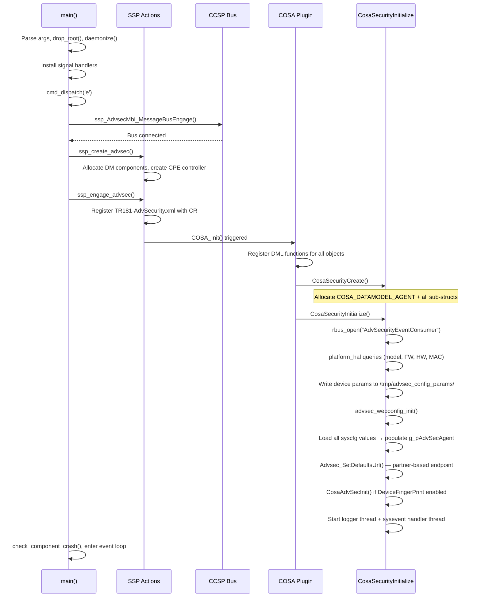
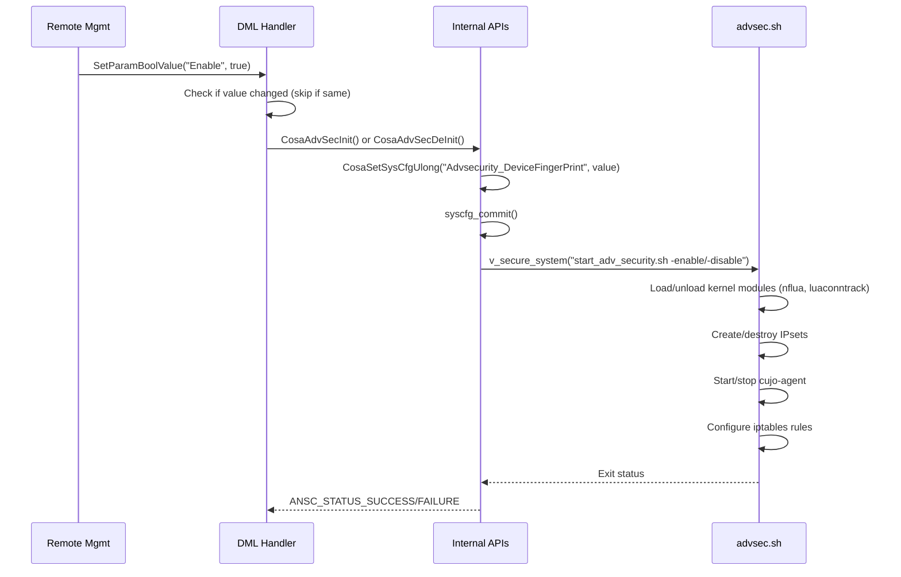
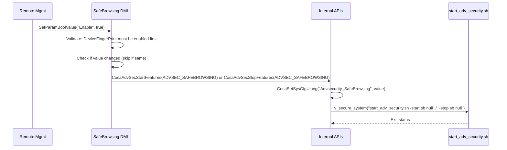
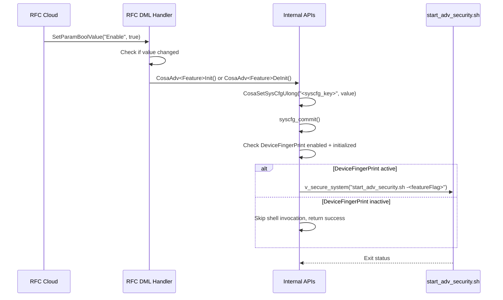
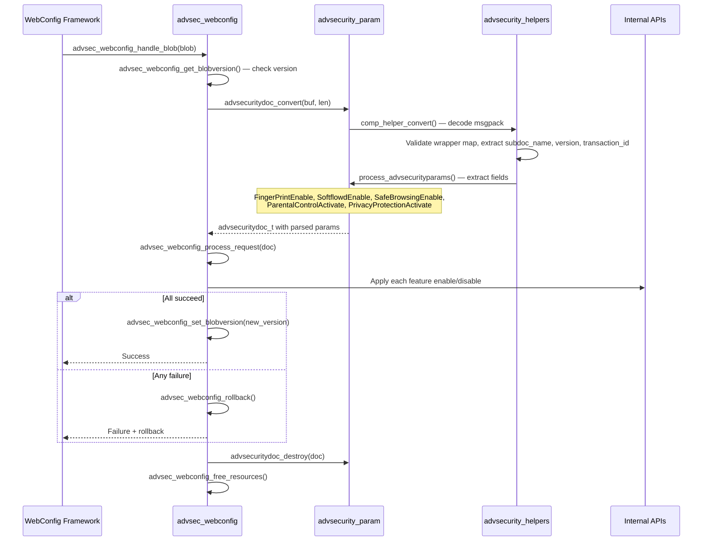
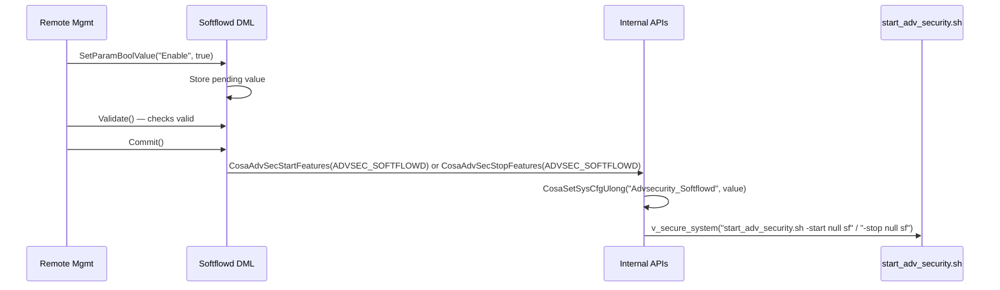
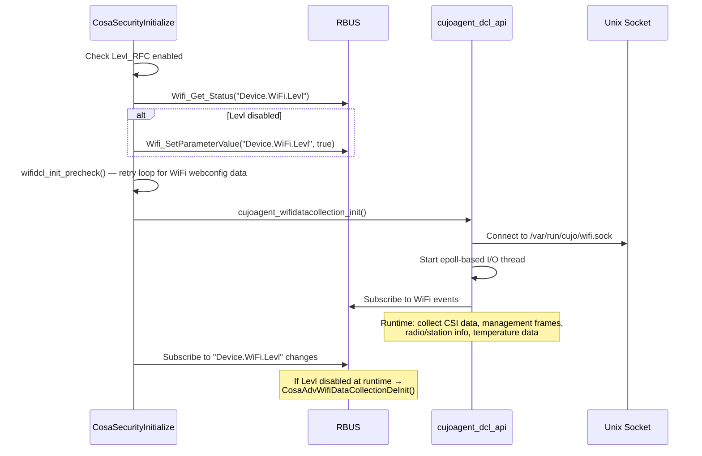
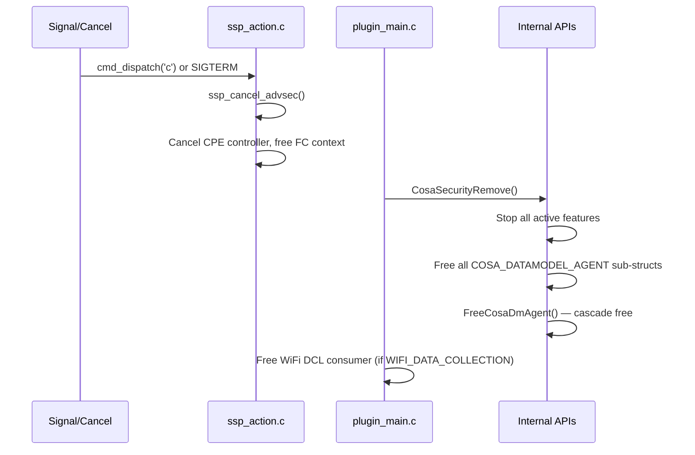

# Advanced Security Functional Workflows

This document describes implemented runtime workflows derived from the current source code paths in:

- `source/AdvSecuritySsp/ssp_main.c`, `ssp_action.c`
- `source/AdvSecurityDml/cosa_adv_security_internal.c`
- `source/AdvSecurityDml/cosa_adv_security_dml.c`
- `source/AdvSecurityDml/cosa_adv_security_webconfig.c`
- `source/AdvSecurityDml/advsecurity_param.c`
- `scripts/advsec.sh`, `scripts/start_adv_security.sh`

See [architecture.md](architecture.md) for system design and component detail.

## 1. Component Startup Workflow

### Key Conditions

- If MAC address retrieval fails (CM HAL or sysevent), the process exits after 30s sleep
- `rbus_open` failure causes `ANSC_STATUS_FAILURE` return, blocking startup
- UserSpace RFC defaults to enabled (1) if syscfg value is 0

## 2. Feature Enable/Disable Workflow (DeviceFingerPrint)

### Key Conditions

- Enable requires agent binary to exist on filesystem
- Bridge mode detection suppresses certain features
- Enable creates `/tmp/advsec_initialized` marker file
- Disable removes marker and cleans up kernel modules

## 3. SafeBrowsing Enable/Disable Workflow

### Validate/Commit/Rollback Cycle

Although `SafeBrowsing_Validate()`, `SafeBrowsing_Commit()`, and `SafeBrowsing_Rollback()` are registered in the data model XML, they are **currently NO-OPs** in the source code:
- `SafeBrowsing_Validate()` — always returns `TRUE`
- `SafeBrowsing_Commit()` — always returns `0`
- `SafeBrowsing_Rollback()` — always returns `0`

The actual enable/disable logic executes **directly in `SafeBrowsing_SetParamBoolValue()`** via `CosaAdvSecStartFeatures()`/`CosaAdvSecStopFeatures()`.

### LookupTimeout Configuration

1. Set via `SafeBrowsing_SetParamUlongValue("LookupTimeout", value)`
2. Bounded by `ADVSEC_DEFAULT_LOOKUP_TIMEOUT` (350) to `ADVSEC_MAX_LOOKUP_TIMEOUT` (6000). Note: there is no separate `ADVSEC_MIN_LOOKUP_TIMEOUT` constant; the default value is used as the lower bound
3. Persisted to syscfg key `Advsecurity_LookupTimeout`
4. Applied to agent via shell script

## 4. RFC Feature Toggle Workflow

### Pattern

All RFC features follow the same pattern:
1. DML handler receives boolean set
2. Calls paired Init/DeInit function
3. Init persists to syscfg, checks if DeviceFingerPrint is active
4. If active, invokes `start_adv_security.sh` with feature-specific flag
5. If not active, only persists the flag for future activation

## 5. WebConfig Blob Processing Workflow

### WebConfig Subdoc

- Subdoc name: `advsecurity` (defined as `ADVSEC_WEBCONFIG_SUBDOC_NAME`)
- Blob format: msgpack map with boolean fields
- Fields: `FingerPrintEnable`, `SoftflowdEnable`, `SafeBrowsingEnable`, `ParentalControlActivate`, `PrivacyProtectionActivate`
- Version tracked via `advsec_webconfig_get/set_blobversion()`

## 6. Softflowd Workflow

## 7. Parental Control and Privacy Protection Workflow

Both follow the same pattern — no Validate/Commit/Rollback cycle (direct SetParamBoolValue):

1. DML `SetParamBoolValue` checks if value changed
2. Calls `CosaStartAdvParentalControl(TRUE)`/`CosaStopAdvParentalControl(TRUE)` or `CosaStartPrivacyProtection(TRUE)`/`CosaStopPrivacyProtection(TRUE)`
3. Persists to syscfg (`Adv_PCActivate` / `Adv_PPActivate`)
4. If DeviceFingerPrint active (checked via `Is_Agent_Initialization_Completed()`), invokes `start_adv_security.sh -startAdvPC/-stopAdvPC` or `-startPrivProt/-stopPrivProt`

## 8. WiFi Data Collection Workflow (Conditional: WIFI_DATA_COLLECTION)

### Key Conditions

- Requires both `WIFI_DATA_COLLECTION` build flag AND `Levl_RFC` enabled
- `wifidcl_init_precheck()` retries up to 5 times (15s delay) during early boot, 1 time after 600s uptime
- Socket path: `/var/run/cujo/wifi.sock` (privileged) or `/tmp/wifi.sock` (non-privileged)

## 9. Sysevent Handler Workflow

The sysevent handler thread (`advsec_handle_sysevent_async`) monitors four events:

| Event | Key | Action |
|-------|-----|--------|
| Bridge mode | `bridge_mode` | Disable/re-enable features based on bridge mode state |
| Cloud host IP | `advsec_host_ip` | Write resolved IP to `/tmp/advsec_cloud_ipv4` |
| MAP-T config | `mapt_config_flag` | Trigger agent restart for MAP-T configuration changes |
| WAN interface | `current_wan_ifname` | Detect WAN interface change, restart agent if needed |

## 10. CPU/Memory Recovery Workflow

The `advsec_cpu_mem_recovery.sh` script runs periodically:

1. Check if `cujo-agent` process exists
2. Read current CPU and memory usage
3. Compare against soft and hard thresholds
4. If hard limit exceeded → kill and restart agent
5. If soft limit exceeded → log warning, increment counter
6. Monitor `nflua` kernel module memory usage separately
7. Log recovery actions for telemetry

## 11. Component Shutdown Workflow

## 12. Logger Thread Workflow

1. `advsec_start_logger_thread()` spawns a dedicated thread
2. Thread sleeps for configurable `LoggingPeriod` (default: `ADVSEC_DEFAULT_LOG_TIMEOUT`)
3. On wake: invokes `advsec_log_fp_status.sh` for telemetry
4. Period adjustable via `CosaAdvSecSetLoggingPeriod()` → signals logger thread via `pthread_cond_signal`
5. Uses `pthread_mutex_t logMutex` + `pthread_cond_t logCond` for thread-safe period changes

## 13. Endpoint URL Configuration Workflow

1. On init, `Advsec_SetDefaultsUrl()` fetches partner-based URL via PAM component
2. Retrieves `Device.DeviceInfo.X_RDKCENTRAL-COM_Syndication.AdvsecRedirectorURL`
3. Stores as default in syscfg key `Advsecurity_DefaultEndpointURL`
4. Custom URL settable via `DeviceFingerPrint_SetParamStringValue("EndpointURL", url)`
5. URL validated by `isValidUrl()` — must start with `https://`, no injection characters
6. Custom URL persisted to syscfg key `Advsecurity_CustomEndpointURL`
